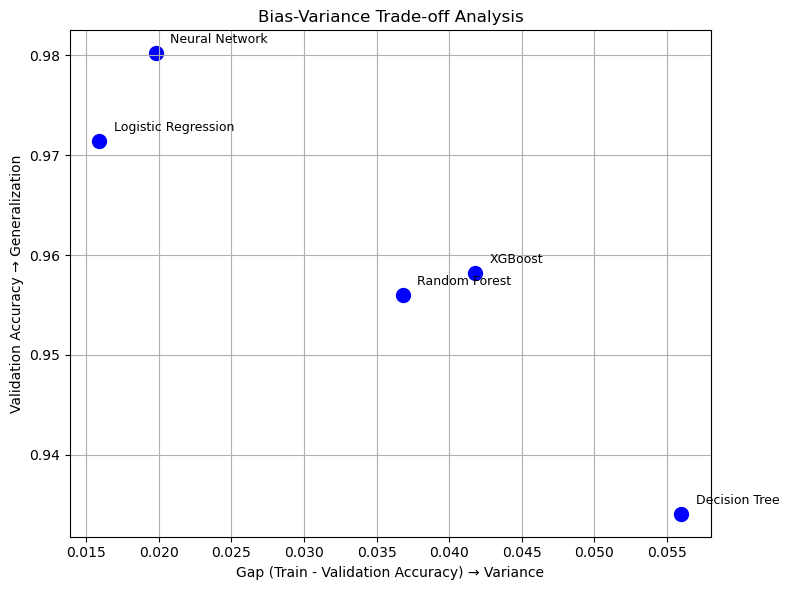

# Early Detection of Breast Cancer Using Machine Learning

## About

This project applies supervised and unsupervised machine learning techniques to support the early detection of breast cancer. Using diagnostic measurements from digitized images of breast mass cell nuclei, the project builds models that classify tumors as malignant or benign.

The goal is to demonstrate an end-to-end machine learning workflow for healthcare classification, including data preprocessing, model training, hyperparameter tuning, evaluation, bias-variance analysis, and anomaly detection.

## Project Overview

Breast cancer diagnosis is a high-impact classification problem where model performance must be evaluated carefully. This project compares multiple machine learning approaches for binary classification and explores how unsupervised methods can identify natural groupings and potential anomalies in the diagnostic data.

The workflow includes:

* Data cleaning and preparation
* Exploratory data analysis
* Feature scaling and preprocessing
* Supervised classification modeling
* Hyperparameter tuning
* Bias-variance analysis
* Unsupervised clustering
* Anomaly detection
* Model evaluation using classification metrics

## Dataset

* **Source file:** `data/BreastCancer_Screening.csv`
* **Size:** 569 rows × 32 columns
* **Target variable:** `Diagnosis`
* **Classes:** `M` = Malignant, `B` = Benign
* **Features:** Diagnostic measurements such as radius, texture, area, smoothness, and related mean, standard error, and worst-value measurements

## Models Implemented

### Supervised Learning

* Logistic Regression
* Decision Tree Classifier
* Tuned Decision Tree
* Random Forest Classifier
* Tuned Random Forest
* XGBoost Classifier
* Tuned XGBoost
* Neural Network using Keras/TensorFlow
* Manual Logistic Regression implemented from scratch

### Unsupervised Learning

* K-Means Clustering
* Isolation Forest for anomaly detection

## Performance Summary

The table below summarizes model performance on the test set. Precision, recall, and F1-score are reported for the malignant class.

| Model                 | Accuracy | Precision | Recall | F1 Score |
| --------------------- | -------: | --------: | -----: | -------: |
| Logistic Regression   |    0.982 |     1.000 |  0.952 |    0.976 |
| Decision Tree (Tuned) |    0.956 |     1.000 |  0.881 |    0.937 |
| Random Forest         |    0.974 |     1.000 |  0.929 |    0.963 |
| XGBoost (Tuned)       |    0.974 |     1.000 |  0.929 |    0.963 |
| Neural Network        |    0.982 |     0.976 |  0.976 |    0.976 |

## Model Comparison Visualization



The chart compares each model using validation accuracy and the gap between training and validation accuracy. Models closer to the upper-left region show stronger generalization with lower variance.

## Evaluation Insights

* Logistic Regression and the Neural Network achieved the strongest overall accuracy.
* The Neural Network showed strong generalization based on training and validation performance.
* The tuned Decision Tree had the largest train-validation gap among the compared models, suggesting higher variance.
* Random Forest and XGBoost provided strong ensemble-based performance after tuning.
* Recall is especially important in this project because false negatives in a healthcare detection context may carry higher risk.

## Unsupervised Learning Insights

K-Means Clustering was used to explore natural groupings within the diagnostic feature space. Isolation Forest was also applied to identify potential anomalies and compare detected anomalies against known diagnosis labels.

These unsupervised methods helped expand the project beyond standard classification and showed how anomaly detection techniques can provide additional perspectives on healthcare data.

## Key Takeaways

* Feature scaling and preprocessing played an important role in model performance.
* Model comparison helped identify trade-offs between accuracy, precision, recall, and F1-score.
* Ensemble models performed strongly after tuning, but simpler models such as Logistic Regression also produced highly competitive results.
* Neural networks can perform well on structured diagnostic data when evaluated carefully.
* Unsupervised learning added useful exploratory insight into class separation and anomaly behavior.

## Repository Structure

```text
breast_cancer_classification/
  data/
    BreastCancer_Screening.csv
  images/
    bias_variance_tradeoff_analysis.png
  notebooks/
    breast_cancer_detection_ml.ipynb
    data_conversion.ipynb
  .gitignore
  README.md
```

## Notebooks

The main modeling notebook is located at:

```text
notebooks/breast_cancer_detection_ml.ipynb
```

The supporting data conversion notebook is located at:

```text
notebooks/data_conversion.ipynb
```

## Tools and Libraries

* Python
* Pandas
* NumPy
* Matplotlib
* Seaborn
* Scikit-learn
* XGBoost
* TensorFlow / Keras
* Jupyter Notebook

## Portfolio Relevance

This project demonstrates practical machine learning skills relevant to data science and applied AI roles, including classification modeling, model evaluation, feature analysis, neural networks, anomaly detection, and clear technical documentation.

## Author

Edidiong Ibokete
[GitHub Profile](https://github.com/Eddy-bok)
